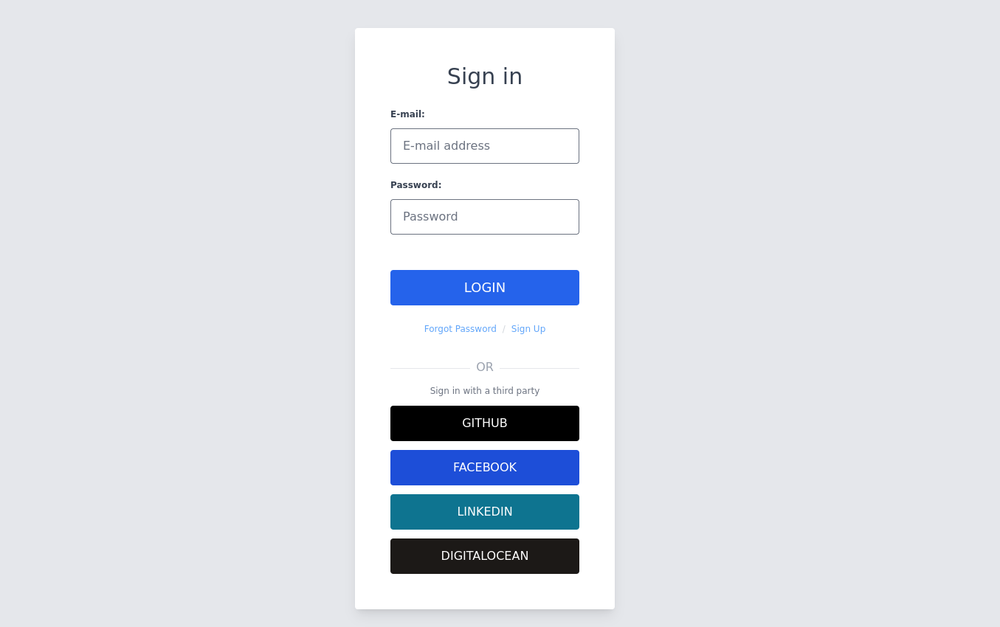
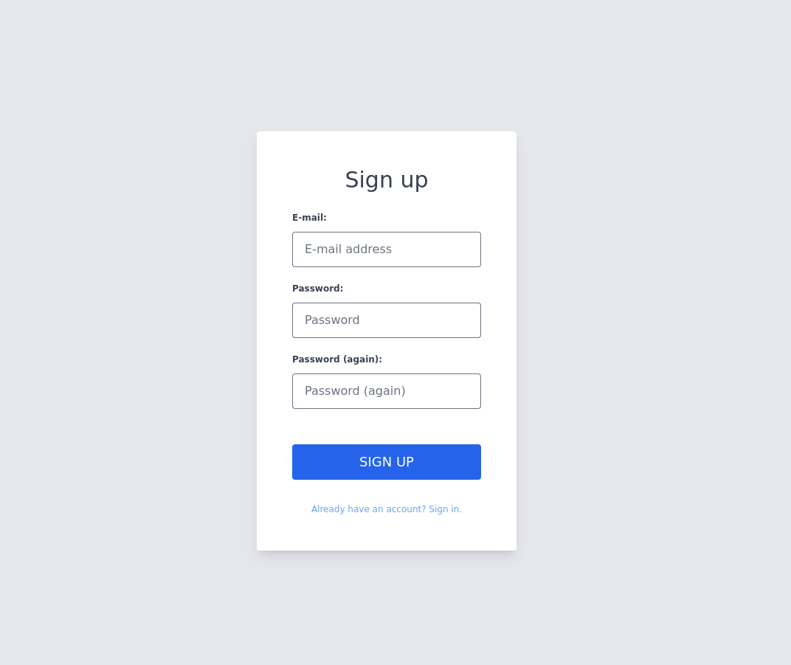
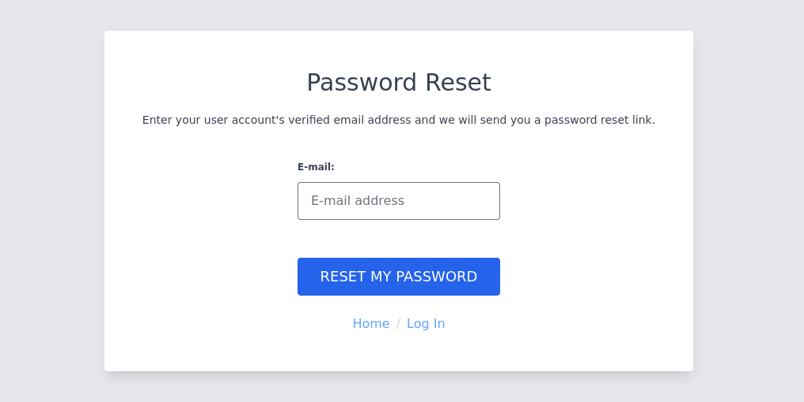

# AllAuth UI

UI templates for [django-allauth](https://github.com/pennersr/django-allauth)
built with Tailwind.

django-allauth is a great library, but the templates it provides out of the box
are minimal html. I usually end up re-designing the login / logout / signup
pages for each new Django project. This library aims at providing decent
defaults for new projects.

* [AllAuth UI](#allauth-ui)
   * [Features](#features)
   * [Installation](#installation)
   * [Screenshots](#screenshots)
   * [Generating screenshots](#generating-screenshots)

## Features

- Responsive design suitable for device sizes from mobile to desktop
- Styled social login themes
- Additional error information when [social logins fail](https://github.com/pennersr/django-allauth/issues/2142)

## Installation


```
pip install django-allauth-ui
pip install django-widget-tweaks
```

django-allauth-ui depends on django-widget-tweaks to render form fields. Make
sure to install django-widget-tweaks and add it to the INSTALLED_APPS.

Add django-allauth-ui **before** django-allauth in your INSTALLED_APPS. See
[./tests/settings.py](./tests/settings.py) for an example.

```python
INSTALLED_APPS = [
    "allauth_ui",
    "allauth",
    "allauth.account",
    "allauth.socialaccount",
    "allauth.socialaccount.providers.github",
    "widget_tweaks",
]
```
**Note**:

When going to **production** you should run ```python manage.py collectstatic```

## Screenshots





## Generating screenshots

```
convert "$1" -crop 1072x901+436+200 crop_signin.png
```
