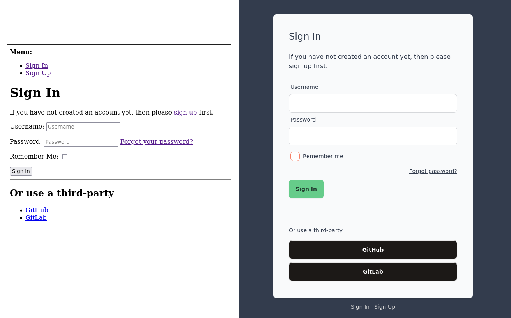

# AllAuth UI




UI templates for [django-allauth](https://github.com/pennersr/django-allauth)
built with Tailwind. https://django-allauth-ui.hodovi.ch.

django-allauth is a great library, but the templates it provides out of the box
are minimal html. I usually end up re-designing the login / logout / signup
pages for each new Django project. This library aims at providing good
defaults for new projects.

## Table of contents

* [Features](#features)
* [Installation](#installation)
* [Configuration](#configuration)
* [Hacking on the project](#hacking-on-the-project)
* [Contributors](#contributors)

## Features

- 📱 Mobile-friendly design
- 💄 Configurable themes
- 🗣️ Translations
  - 🇪🇸 Spanish
  - 🇫🇷 French
  - 🇧🇷 Portuguese

## Installation

```
pip install django-allauth-ui
pip install django-widget-tweaks
pip install slippers
```

django-allauth-ui depends on [jazzband/django-widget-tweaks](https://github.com/jazzband/django-widget-tweaks)
and [mixxorz/slippers](https://github.com/mixxorz/slippers) to render templates. Make
sure to install both packages and add them to the INSTALLED_APPS.

Add django-allauth-ui **before** django-allauth in your INSTALLED_APPS. See
[./tests/settings.py](./tests/settings.py) for an example.

```python
INSTALLED_APPS = [
    "allauth_ui",
    "allauth",
    "allauth.account",
    "allauth.socialaccount",
    "allauth.socialaccount.providers.github",
    "widget_tweaks",
    "slippers",
]
```
**Note**:

When going to **production** you should run ```python manage.py collectstatic```

## Configuration

The templates can be themed using Django settings. The theme value corresponds to [DaisyUI themes](https://daisyui.com/docs/themes/).

```python
# settings.py
ALLAUTH_UI_THEME = "light"
```

## Hacking on the project

```sh
# Clone the repo
git clone git@github.com:danihodovic/django-allauth-ui.git
cd django-allauth-ui.git

# Create the virtual env
python -m venv .venv
# Activate the virtual env. This has to be done every time you enter the directory.
source .venv/bin/activate

# Install the dependencies
pip install --upgrade pip poetry
poetry install

# Install tailwind
npm install

# Run the migrations
./manage.py migrate

# Add sample social providers
./manage.py create_test_providers

# Start the server
./manage.py runserver_plus

# Start the tailwind compilation process in another terminal
npm run-script build:watch
```

Make changes in allauth_ui/templates and open the browser at http://localhost:8000/accounts/login/.

Once you're done compile tailwind with `npm run-script build` and submit a pull-request 🃏

## Contributors
<a href="https://github.com/danihodovic/django-allauth-ui/graphs/contributors">
  
</a>

Made with [contrib.rocks](https://contrib.rocks).
